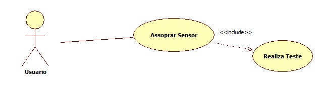

# Casos de uso

## 1. Diagrama de casos de uso

## 2. Especificação dos casos de uso

### 2.1. Caso de uso **Usar Dispositivo**

| Campo          | Informação        |
|---|---|
| Identificador: | UC01              |
| Nome:          | Usar Dispositivo |
| Atores:        | Pessoa submetida ao teste |
| Sumário:       | Faz o uso do dispositvo para gerar resultado |

| Fluxo Principal |
|---|
| 1) O Fiscal de Transito ou policial pede para o individuo realizar o teste. |
| 2) O individuo realiza o teste.                   |
| 3) Sistema calcula o Nivel de teor alcoolico. |
| 4) O sistema retorna a condição e o indiviuo está. |

